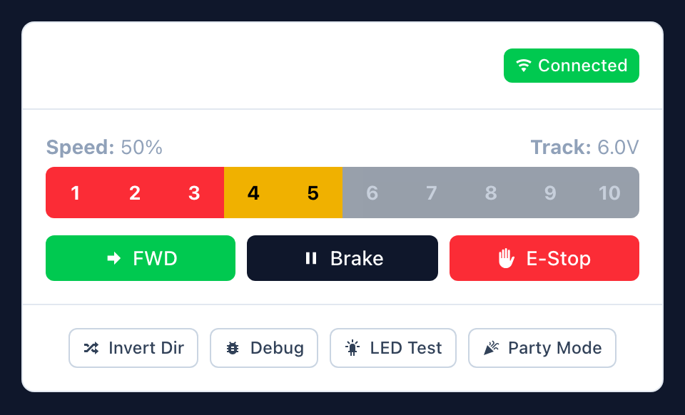

# Z-Duino

[](https://github.com/yamanote1138/z-duino/actions/workflows/ci.yml)
[](#license)


A network-controlled Z-scale model train controller. An ESP8266 (Wemos D1 Mini) drives a TB6612FNG H-bridge motor driver, serving a webapp over WiFi that lets you control your train from any browser on the local network.

Discoverable via mDNS at `http://ztrain.local`.

## Screenshot



## Features

- **Throttle UI** — 10-segment speed bar with colour-coded zones (red/yellow/green), smooth ramping between speed steps
- **Direction control** — forward/reverse toggle with automatic ramp-down-switch-ramp-up when the train is moving
- **Direction invert** — swap forward/reverse polarity to match your track wiring (persisted in browser)
- **Emergency stop** — immediate halt, bypasses ramping, magenta LED blink
- **Status LED** — RGB LED indicates connection and motor state; supports manual colour control via LED test panel
- **Safety timeout** — train stops automatically if the controller loses contact for 30 seconds
- **Zero external dependencies** — everything served from the device itself, no internet required
- **mDNS discovery** — no need to remember IP addresses

## Hardware

Wemos D1 Mini (ESP8266) → TB6612FNG H-bridge → track, plus an RGB status LED. Full parts list, wiring diagram, and pinout live in **[docs/HARDWARE.md](docs/HARDWARE.md)**.

## Quickstart

1. Install [PlatformIO Core](https://docs.platformio.org/en/latest/core/installation/index.html) (`brew install platformio`) and [Node.js](https://nodejs.org/) v18+.
2. Clone the repo and configure WiFi credentials:
   ```bash
   git clone https://github.com/yamanote1138/z-duino.git
   cd z-duino
   cp secrets.ini.example secrets.ini
   # edit secrets.ini with your WiFi SSID/password
   ```
3. Install frontend dependencies and build + flash everything:
   ```bash
   cd frontend && npm install && cd ..
   ./build.sh   # select option 7 (Build + Upload All)
   ```

For the full prerequisites walkthrough and every `build.sh` option, see **[docs/BUILD.md](docs/BUILD.md)**.

## Usage

Power up the Wemos, connect your 12V track supply, and open **http://ztrain.local** in a browser (check the serial monitor at 115200 baud for the IP if mDNS doesn't resolve). Speed segments 1–10 ramp to that throttle level, FWD/REV toggles direction (ramping down/up automatically if moving), Brake ramps to a stop, and E-Stop halts immediately.

> **Z-scale note:** These locomotives are tiny and light. Don't be surprised if nothing happens at low power — it's normal for a Z-scale train to sit still until 40–50% throttle, then take off suddenly once it overcomes static friction. Start around segment 4 and work up from there.

## Documentation

- **[docs/BUILD.md](docs/BUILD.md)** — full prerequisites, setup, and `build.sh` reference
- **[docs/HARDWARE.md](docs/HARDWARE.md)** — parts list & wiring diagram
- **[docs/PROTOCOL.md](docs/PROTOCOL.md)** — WebSocket protocol spec
- **[docs/LITTLEFS.md](docs/LITTLEFS.md)** — LittleFS flash layout & partition details
- **[CONTRIBUTING.md](CONTRIBUTING.md)** — local development setup & project structure

## License

MIT
