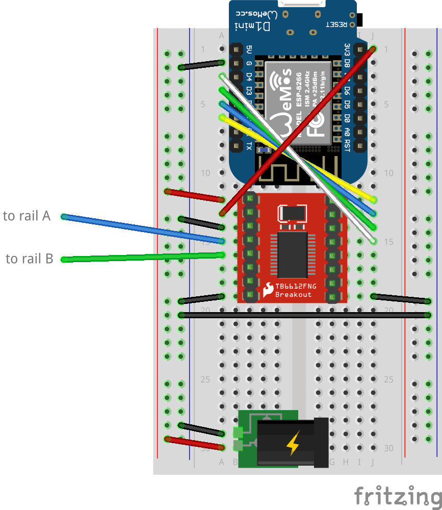

# Hardware

## Parts

| Part | Purpose |
|---|---|
| Wemos D1 Mini (ESP8266) | WiFi microcontroller |
| TB6612FNG breakout | H-bridge motor driver |
| 5mm RGB LED (common cathode) | Status indicator (see [wiring](status-led-wiring.md)) |
| 12V DC power supply | Track power |
| Z-scale track + locomotive | The whole point, really |

## Wiring



```
Wemos D1 Mini          TB6612FNG
─────────────          ─────────
D1 (GPIO5)  ─────────  PWMA      (speed control)
D2 (GPIO4)  ─────────  AIN2      (direction pin 2)
D3 (GPIO0)  ─────────  AIN1      (direction pin 1)
D4 (GPIO2)  ─────────  STBY      (standby — active HIGH)
3.3V        ─────────  VCC       (logic power)
GND         ─────────  GND       (common ground)

12V Supply             TB6612FNG
──────────             ─────────
+12V        ─────────  VM        (motor power)
GND         ─────────  GND       (common ground)

TB6612FNG              Track
─────────              ─────
A01         ─────────  Rail 1
A02         ─────────  Rail 2
```

Only Motor A is used. Motor B pins are left unconnected.

**Status LED** — see [status-led-wiring.md](status-led-wiring.md) for full wiring, resistor values, and pinout. Summary: D5=Red (220Ω), D6=Green (100Ω), D7=Blue (100Ω), GND=Cathode.

**Important:** Connect the Wemos GND and the 12V supply GND to the TB6612FNG's GND — they must share a common ground.
